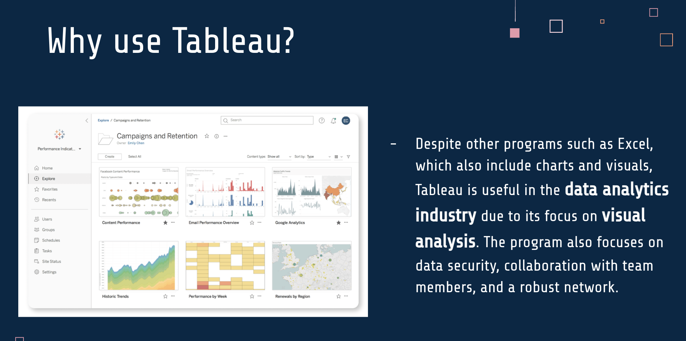
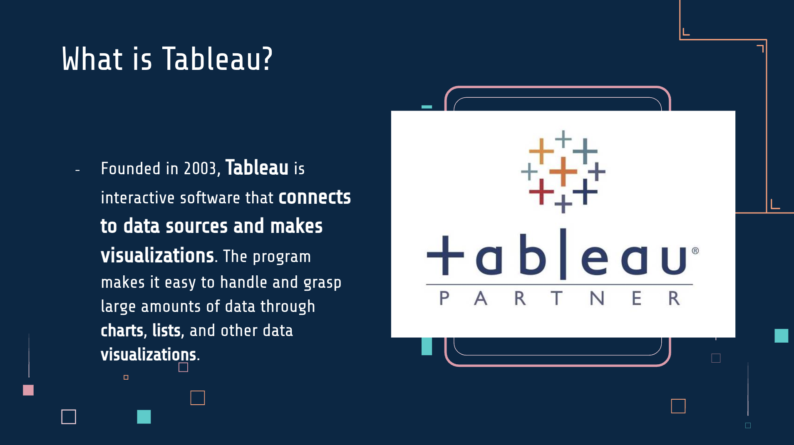
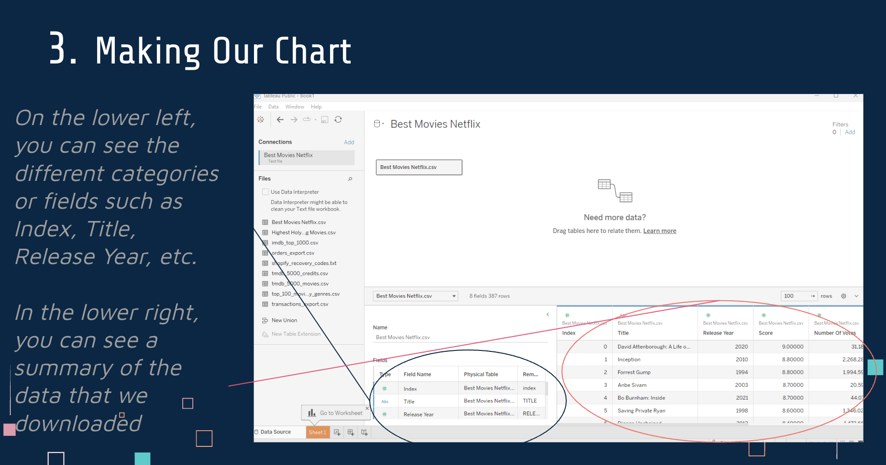
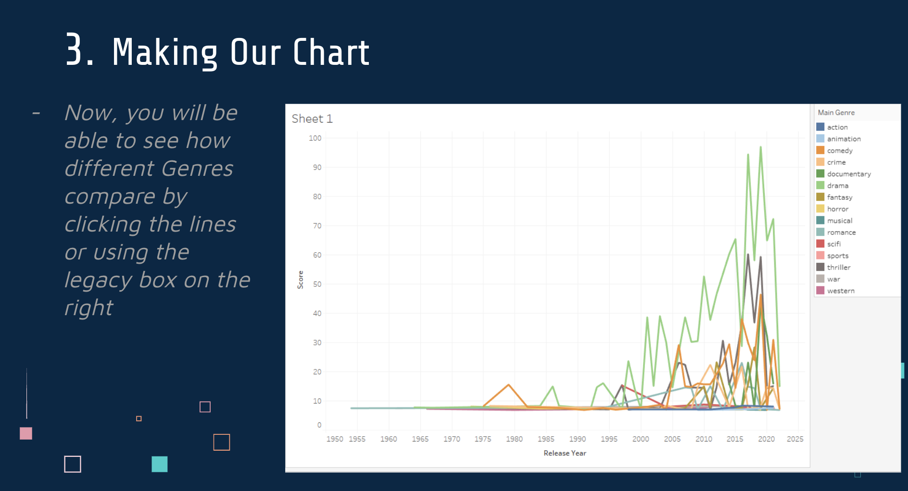

# Tableau User Manual and Data Visualization Task

This project is a beginner-friendly Tableau user manual and guided data visualization task designed to introduce core Tableau concepts, interface navigation, and hands-on chart creation using real-world movie data.

## Overview
This project walks users through the fundamentals of Tableau, from understanding the platform to building and exporting a complete visualization. It is designed for beginners who want a clear, step-by-step introduction to data visualization using Tableau Public.

The project concludes with a hands-on task that guides users through creating their first Tableau chart using a Netflix movie dataset.

The final project can be viewed in the file: [Tableau User Manual Creation and Task (PDF)](Tableau%20User%20Manual%20Creation%20and%20Task.pdf)

## Project Objectives
- Introduce Tableau as a data visualization tool
- Demonstrate how large datasets can be transformed into easy-to-read visuals
- Teach users how to create charts step by step
- Provide a structured learning task using real-world data

## Tools Used
- Tableau Public (Desktop Public Edition)
- Google Slides
- Kaggle datasets
- CSV data files

## Dataset
The visualization task uses a publicly available Kaggle dataset containing Netflix movie data, including:
- Movie titles
- Release years
- Genres
- Critic scores

Users learn how to import, explore, and visualize this dataset within Tableau.

## What This Project Covers
- Tableau overview and use cases
- Tableau interface walkthrough
- Importing and preparing CSV data
- Understanding dimensions and measures
- Chart creation using rows and columns
- Filtering and grouping data
- Exporting and sharing Tableau visualizations

## Final Task
Users are guided through creating a line chart titled:

**Movie Scores by Release Year and Genre**

This task demonstrates how Tableau automatically aggregates data and allows users to visually compare trends across genres over time.

## Visual Preview

**Why use Tableau**

**Tableau interface and concepts**

**User manual walkthrough**

**Visualization instructions**

**Final chart output**

## How to Use This Repository
1. Review the images to understand Tableau concepts and workflow
2. Follow the visualization instructions to recreate the chart in Tableau Public
3. Apply the same steps to other datasets to build additional visualizations

## Notes
- This project was created for educational and portfolio purposes
- Instructions are written primarily for beginner Tableau users
- Dataset sources are publicly available through Kaggle

## What I Learned

Through this project, I gained hands-on experience using Tableau as a data visualization tool and learned how to translate raw datasets into clear, readable visuals. I developed a stronger understanding of Tableau’s interface, including how dimensions and measures work together to generate different types of charts.

I learned how to import and explore CSV datasets, identify relevant fields, and structure data using rows, columns, and marks to create meaningful visualizations. This project reinforced how Tableau automatically aggregates data and how those aggregations impact the insights being displayed.

Creating a step-by-step user manual helped me improve my ability to explain technical concepts in a clear and beginner-friendly way. I learned how to document workflows, break down complex steps, and design instructional content that guides users through both the technical process and the reasoning behind each action.

Overall, this project strengthened my data visualization fundamentals, technical communication skills, and confidence working with Tableau to analyze and present data effectively.
